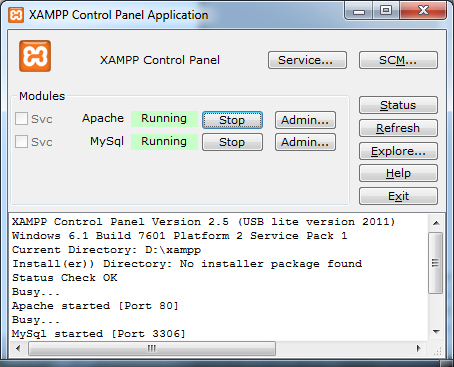

# PHP labor

## Felkészülés
A laborra felkészüléshez olvassa el a segédletet és próbáljon meg válaszolni az ellenőrző kérdésekre.

## Útmutató
Ebbe a könyvtárba készítse el a PHP labor megoldásait. A megoldásokat pull request formájában adja be a határidőre úgy, hogy reviewerként hozzárendeli a laborvezetőjét.
Figyeljen rá a labor elején, hogy hozzon létre egy új git branchet, mert a pull request létrehozásánal azt tudja majd a master ággal összehasonlítani.

Amennyiben a labor szöveges válaszokat kér kérdésekre, azokat a válaszokat ide írja be!

## Előkészületek
A feladatok megoldása során szükségünk lesz a MySQL adatbázsiszerverre és a PHP szkripteket futtatni képes webszerverre, ezért ezeket még a gyakorlat elején indítsuk el a XAMPP Control Panel segítségével:



# Adatbázis és munkakönyvtár előkészítése

Készítsünk egy új SQL adatbázist készítünk `info2` néven. Ebbe az adatbázisba egyetlen táblát fogunk felvenni: a `telefonkonyv` táblát. A telefonkönyv kezdeti feltöltése után egy weboldalt készítünk, mely a telefonkönyv tartalmát jeleníti meg.

A korábbi gyakorlatokon tanultaknak megfelelően hozzunk létre egy `info2` nevű sémát a MySQL szerveren. Az `info2` adatbázisba tegyünk be egy új táblát `telefonkonyv` néven:

```sql
CREATE TABLE telefonkonyv (

id int primary key auto_increment,

nev varchar(100),

szam varchar(100)

)
```

Vegyünk fel néhány sort az adattáblába:

```sql
INSERT INTO telefonkonyv(nev,szam) VALUES('Dávid Zoli', '+36-1-4633714');

INSERT INTO telefonkonyv(nev,szam) VALUES('Kovács Feri', '+36-1-4631648');

INSERT INTO telefonkonyv(nev,szam) VALUES('Mészáros Tomi', '+36-1-4634225');
```

Az Apache webszerver a XAMPP telepítő könyvtárán belül a htdocs könyvtárból szolgálja ki a kéréseket. Hozzunk itt létre egy `info2` nevű könyvtárat! Mostantól az alkalmazásunk a [`localhost:80/info2/`](localhost:80/info2/) címen lesz elérhető. Másoljuk be a kiinduló fájlokat: `index.php`, `insert.php` és `theme.css` az `info2` könyvtárba. A nyitóoldal a [`localhost:80/info2/index.php`](localhost:80/info2/index.php) címen érhető el.

## 1. Megjelenítő webalkalmazás készítése

Az `index.php` oldal megjelenít egy táblázatot, amiben telefonszámokat és neveket lehet megjeleníteni. Írjunk php szkriptet, amely az adatokat felolvassa az adatbázisból és az alapján feltölti a táblázatot!

## 2. Új telefonszámok felvitele

Ebben a feladatban egy olyan oldalt készítünk (`insert.php`), ami lehetővé teszi új telefonszámok felvitelét. Az adatbevitelt a HTML nyelv `form` tagjével oldjuk meg. A bevitt adatokat a PHP kódban adatbázisba mentjük.

## 3. Telefonszámok törlése

A főoldalon a táblázatban jelenítsünk meg egy harmadik oszlopot, amelyben egy `Töröl` feliratú link jelenik meg. A link irányítson át `delete.php` oldalra és URL paraméterben tartalmazza a törölni kívánt bejegyzés azonosítóját. A `delete.php` törölje a megfelelő sort az adatbázisból, majd irányítsa vissza a felhasználót a kezdőoldalra.

## 4. _Visszajelzés a felhasználónak – önállló feladat_

Gondoskodjunk arról, hogy mind új adat felvitelénél, mind törlésnél a kezdőoldalra történő visszairányítás után valamilyen üzenet jelenjen meg az oldalon, amelyben tájékoztatjuk a felhasználót, hogy sikeres volt a művelet.

## 5. _Hibakezelés – önálló feladat_

Gondoskodjunk néhány egyszerű hiba kivédésről:

- Ne lehessen üres névvel új bejegyzést beszúrni!
- A `delete.php` oldalon ellenőrizzük, hogy megtalálható-e az adott azonosítójú bejegyzés az adatbázisban.